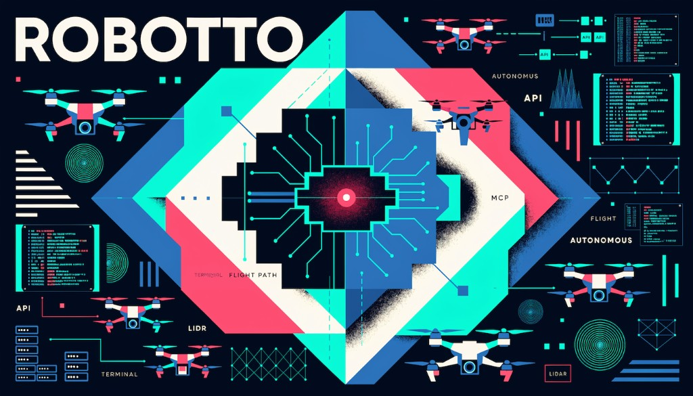

<p align="center">
  
</p>

# AI Drone Toolkit

MCP servers and tools for intelligent drone development (PX4 and beyond). The
toolkit gives AI assistants (Cursor, Claude, etc.) structured tools to
understand, debug, and reason about drone systems — starting with PX4 flight
logs and simulation-only PX4 SITL command.

This is a [uv](https://docs.astral.sh/uv/) workspace monorepo: shared logic
lives in a core package, and each tool is a thin, independently usable layer on
top of it.

## Repository layout

| Path | Description |
|------|-------------|
| [`packages/robotto-drone-core`](packages/robotto-drone-core) | Shared, MCP-agnostic parsers, safety checks, and coordinate-frame utilities. |
| [`tools/px4-ulog-mcp`](tools/px4-ulog-mcp) | MCP server for inspecting PX4 ULog (`.ulg`) flight logs. |
| [`tools/px4-sitl-mcp`](tools/px4-sitl-mcp) | Simulation-only MCP server for commanding PX4 SITL with safety checks. |
| [`docs/`](docs) | Project-wide documentation. |
| [`examples/`](examples) | Runnable examples and demos. |

## Getting started

Requires Python 3.12+ and [uv](https://docs.astral.sh/uv/).

```bash
git clone https://github.com/robotto-xyz/ai-drone-toolkit.git
cd ai-drone-toolkit
uv sync --all-packages
```

This sets up a single virtual environment for the whole workspace. From there,
work on any member, e.g. run the PX4 ULog MCP server or the PX4 SITL command
server:

```bash
uv run px4-ulog-mcp
uv run px4-sitl-mcp
```

## Examples

Runnable scripts live in [`examples/`](examples) and drive the shared core
package or tool layers directly:

```bash
# Summarize a flight log (defaults to the PX4 sample fixture):
uv run python examples/analyze_ulog.py /absolute/path/to/flight.ulg

# Flag warnings/errors and the flight-mode timeline:
uv run python examples/flight_health_check.py /absolute/path/to/flight.ulg

# Requires a running PX4 SITL instance:
uv run python examples/sitl_connect_state.py
```

See [`examples/README.md`](examples/README.md) for details.

## Documentation

- [`docs/`](docs) — architecture and project-wide guides.
- [`packages/robotto-drone-core/README.md`](packages/robotto-drone-core/README.md)
  — shared parsing, safety, and frame-conversion APIs.
- [`tools/px4-ulog-mcp/README.md`](tools/px4-ulog-mcp/README.md) — install,
  wire into your editor, and analyze flight logs.
- [`tools/px4-sitl-mcp/README.md`](tools/px4-sitl-mcp/README.md) — connect to
  PX4 SITL, inspect state, and issue simulation-only commands.

## License

MIT.
